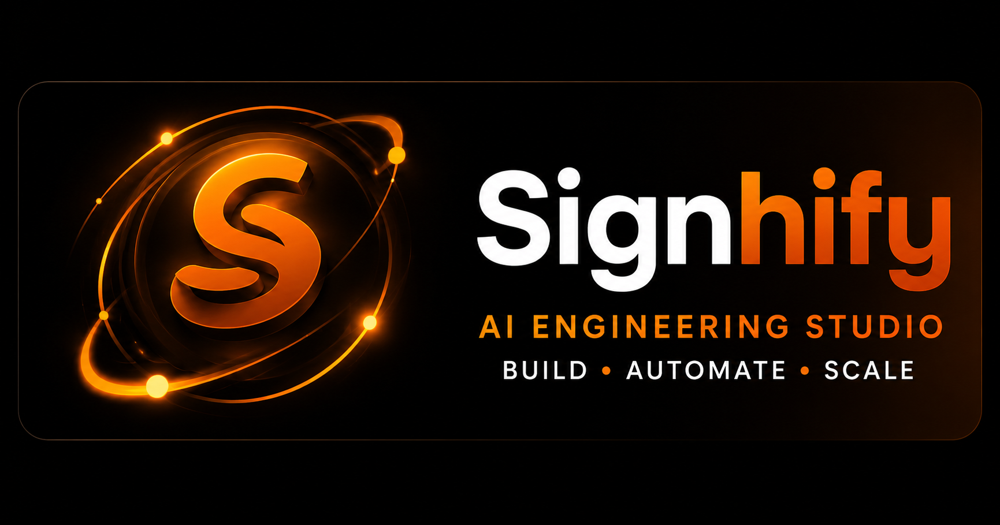

<p align="center">
  <picture>
    <source media="(prefers-color-scheme: dark)" srcset="./assets/banners/signhify-banner-dark.png">
    
  </picture>
  <br>
  <em>Your AI engineering partner — in the terminal and in the IDE</em>
</p>

<p align="center">
  <a href="https://github.com/Warriorlegacy/Signhify_CLI/blob/main/LICENSE">
    
  </a>
  <a href="https://www.npmjs.com/package/@signhify/cli">
    
  </a>
  <a href="https://github.com/Warriorlegacy/Signhify_CLI/releases">
    
  </a>
  <a href="https://github.com/Warriorlegacy/Signhify_CLI/actions/workflows/test.yml">
    
  </a>
  <a href="https://nodejs.org/">
    
  </a>
  <a href="https://github.com/Warriorlegacy/Signhify_CLI/blob/main/CONTRIBUTING.md">
    
  </a>
  <a href="https://github.com/Warriorlegacy/Signhify_CLI/discussions">
    
  </a>
</p>

---

Signhify is an open-source AI coding agent that plans, writes, tests, and fixes code from natural language. It remembers your project across sessions, runs unattended in CI/CD, and ships as both a **CLI** and a **VS Code extension** sharing one core engine.

## Features

- **Multi-agent modes** — Build (full access), Plan (read-only), Debug, Compose
- **Multi-provider** — OpenAI, Anthropic, Google Gemini, or any OpenAI-compatible endpoint (Ollama, Groq, OpenRouter, etc.)
- **Two-tier model routing** — fast model for inline autocomplete, reasoning model for agent loop
- **Persistent memory** — SQLite + FTS5 for fast retrieval, human-readable markdown for auditability
- **Checkpoint system** — auto-snapshot at 80% context window; resume mid-task without truncation
- **Goal/judge verification** — set a stop condition, verified by independent model
- **Dream/Distill** — session trace distillation into long-term memory and reusable agents
- **MCP support** — Model Context Protocol client for extensibility (servers, tools, resources)
- **CI/CD mode** — `--auto --output json` for scripted pipelines
- **VS Code extension** — chat panel + inline autocomplete

## Quick Install

### via npm (global)

```bash
npm install -g @signhify/cli
signhify --help
```

### via npm (run on demand)

```bash
npx signhify run "explain this codebase" --mode plan
```

### via PowerShell (Windows)

```powershell
irm https://signhify-cli.vercel.app/install.ps1 | iex
```

### via curl (macOS / Linux)

```bash
curl -fsSL https://signhify-cli.vercel.app/install.sh | bash
```

## Getting Started

```bash
# Start the interactive TUI
signhify

# Run a task in plan mode (read-only, safe)
signhify run "explain the architecture" --mode plan

# Run a task fully autonomously with a stop goal
signhify run "add dark mode to the app" --auto --goal "all tests pass"

# Launch the setup wizard
signhify wizard

# Get help
signhify --help
```

### CLI Commands

| Command | Description |
|---|---|
| `signhify` | Interactive TUI (default) |
| `signhify run <task>` | Execute a task non-interactively |
| `signhify wizard` | First-run setup wizard |
| `--mode <mode>` | Agent mode (build/plan/debug/compose) |
| `--auto` | Automatic mode (no confirmation prompts) |
| `--output json` | Structured JSON output for CI/CD |
| `--goal <goal>` | Stop condition (e.g., "all tests pass") |

### Slash Commands (in TUI)

| Command | Description |
|---|---|
| `/goal <goal>` | Set a stop condition |
| `/dream` | Distill session into MEMORY.md |
| `/distill <name>` | Create a reusable agent from this session |
| `Tab` | Cycle through agent modes |

## Development

```bash
# Prerequisites: Node.js 20+, npm 9+
git clone https://github.com/Warriorlegacy/Signhify_CLI.git
cd Signhify_CLI
npm install
npm run build

# Run tests
npm test

# Lint & typecheck
npm run lint
npm run typecheck

# Run individual package
npm run dev -w packages/cli
```

## Configuration

Signhify is configured via `signhify.config.json` at your project root. Configuration is hierarchical:

1. Project config: `.signhify/config.json`
2. User config: `~/.config/signhify/config.json`
3. CLI flags (highest priority)

See the [JSON Schema](signhify.config.schema.json) for full options.

## Architecture

```
                    ┌──────────────────────────────┐
                    │   CLI (Ink TUI) / VS Code Ext │
                    └──────────┬───────────────────┘
                               │ JSON-RPC
                    ┌──────────▼───────────────────┐
                    │     @signhify/core            │
                    │  AgentLoop, Modes, Permissions │
                    └──────┬──────────┬─────────────┘
                           │          │
              ┌────────────▼──┐  ┌────▼────────────┐
              │ @signhify/    │  │ @signhify/       │
              │  providers    │  │  memory           │
              │ (4 adapters)  │  │ (SQLite+FTS5)    │
              └───────────────┘  └────┬────────────┘
                                      │
              ┌───────────────────────▼────────────┐
              │      @signhify/tools                │
              │  file-io, shell, git, search,       │
              │  browser, mcp-client                │
              └────────────────────────────────────┘
```

## Roadmap

| Phase | Scope | Status |
|---|---|---|
| v0.1 | CLI, single provider, Build+Plan modes, file/shell/git tools | ✅ |
| v0.2 | Multi-provider, BYO keys, memory system | ✅ |
| v0.3 | `--auto` mode, goal/judge, JSON output, CI-safe permissions | ✅ |
| v0.4 | VS Code extension (chat + inline autocomplete) | ✅ |
| v0.5 | Subagents, MCP client, Compose mode | 🔄 |
| v1.0 | Dream/Distill, marketplace, stable release | 🔄 |

## Community

- [GitHub Issues](https://github.com/Warriorlegacy/Signhify_CLI/issues) — bug reports, feature requests
- [GitHub Discussions](https://github.com/Warriorlegacy/Signhify_CLI/discussions) — questions, ideas
- [Contributing Guide](CONTRIBUTING.md) — how to contribute
- [Code of Conduct](CODE_OF_CONDUCT.md) — community standards

## Packages on npm

| Package | Version | Description |
|---|---|---|
| [`@signhify/core`](https://www.npmjs.com/package/@signhify/core) | [](https://www.npmjs.com/package/@signhify/core) | Agent loop, modes, permissions, context management |
| [`@signhify/providers`](https://www.npmjs.com/package/@signhify/providers) | [](https://www.npmjs.com/package/@signhify/providers) | OpenAI, Anthropic, Gemini, OpenAI-compatible adapters |
| [`@signhify/tools`](https://www.npmjs.com/package/@signhify/tools) | [](https://www.npmjs.com/package/@signhify/tools) | File I/O, shell, git, search, browser, MCP client |
| [`@signhify/memory`](https://www.npmjs.com/package/@signhify/memory) | [](https://www.npmjs.com/package/@signhify/memory) | SQLite+FTS5, checkpoints, dream/distill engine |
| [`@signhify/cli`](https://www.npmjs.com/package/@signhify/cli) | [](https://www.npmjs.com/package/@signhify/cli) | Terminal TUI (Ink) + non-interactive runner |

## Security

See [SECURITY.md](SECURITY.md) for our threat model and vulnerability reporting process.

## License

MIT — see [LICENSE](LICENSE). Use must comply with our [Acceptable Use Policy](USE_RESTRICTIONS.md).

---

<p align="center">Built with ❤️ by the Signhify community</p>
